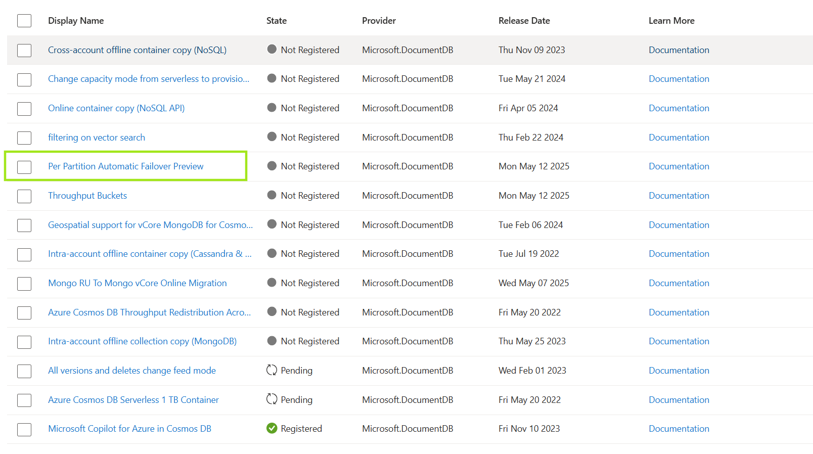

# How to Onboard and Adopt Per-Partition Automatic Failover (PPAF) for Azure Cosmos DB

**Per-Partition Automatic Failover (PPAF)**  is a new Azure Cosmos DB feature (currently in **Public Preview**) that improves availability for single-write region accounts. Instead of failing over an entire database account during a regional outage, Cosmos DB can **automatically fail over at the *partition level***, preserving writes for unaffected partitions and minimizing downtime. This guide provides a comprehensive **how-to** for external users to onboard and adopt PPAF, including prerequisites, step-by-step setup, best practices, and troubleshooting tips.


## Prerequisites

Before enabling PPAF, ensure your environment meets the following **prerequisites** and **requirements**:

- **Azure Cosmos DB Account Type:** **Single-write region** account (one writable primary region) with **at least one** additional **read region** configured.
- **Consistency Model:** In the current preview, **Strong**, **Session**, **Consistent Prefix**, or **Eventual** consistencies are also supported, but **Bounded Staleness** is not yet supported
- **API Type:** The account must use the **Core (SQL) API** (NoSQL API).
- **Azure Region:** The account should be in **Azure public cloud regions** (global Azure). Accounts in sovereign clouds are not eligible during preview.
- **SDK Version:** Your application must use a **latest supported Azure Cosmos DB SDK** that implements PPAF logic. Currently, the preview supports:
  - **.NET SDK v3** 
  - **Java SDK**
  - Support for other languages will be added later; check updated documentation as the feature matures.


## Register for Preview

To enable this feature, register for the preview feature **Per Partition Automatic Failover Preview** in your subscription. For more information, see [register for an Azure Cosmos DB preview feature](../access-previews.md).



You can also reach out to cosmosdbppafpreview@microsoft.com if you have any questions about the onboarding. 

## Configure Your Client SDK for PPAF

Configuring your application’s Cosmos DB SDK is **critical** so that it knows to handle partition-level failovers. Without this, your client might not properly redirect writes during a partition failover.

- **Upgrade SDK:** Ensure your app is running the **latest SDK version** that supports PPAF (as identified in prerequisites).
- **Configure secondary region:** Ensure your Azure Cosmos DB accoutn has atleast 1 secondary region. Use the following [guide]


## Test the PPAF Setup (Simulate Fault)

With the account and client configured, it’s prudent to **test** that everything works as expected before a real outage occurs. Azure Cosmos DB provides a way to simulate partition failures in the preview for PPAF enabled accounts:

- **Chaos Simulation (Preview):** Customers can now manage the fault via the Resource Provider REST API. Eventually the fault will also be exposed through the Azure Portal, Azure PowerShell and Azure CLI. For ease of use we are providing a PowerShell script for managing the fault.
  - Download the script "EnableDisableChaosFault.ps1" for [github]([link](https://github.com/AzureCosmosDB/ppaf-samples/blob/main/ppaf-fault-script/EnableDisableChaosFault.ps1))
  - Start PowerShell and login to your subscription using “az login”
  - Navigate to the folder with the PowerShell script and invoke the script with the required parameters as specified below to invoke the fault: 
    - It might take up to 15 minutes for the fault to become effective
    - The fault gets effective on 10% of total partition for the specified container with a maximum of 10 partition and minimum 1 Partition
    ``` powershell
    .\EnableDisableChaosFault.ps1 -FaultType "PerPartitionAutomaticFailover" -ResourceGroup "{ResourceGroupName}" -AccountName "{DatabaseAccountName}" -DatabaseName "{DatabaseName}" -ContainerName "{CollectionName}"  -SubscriptionId "{SubscriptionId}" -Region "{PreferredWriteRegion}" -Enable
    ```

- **Application Testing:** Test critical transactions of your application during the failover. Ensure that there are no unhandled exceptions. Because PPAF is transparent, most applications won’t need changes to handle the failover beyond what you’ve already configured. 
- **Metrics:** 
  - You can verify in the Azure Portal’s Metrics for your account. Look at metrics like **Total Requests** broken down by region – you should see write operations occurring in a secondary region during the simulation, confirming the failover worked.
  - We have also introduced a new metric called as **PartitionWriteGlobalStatus** that shows the count of write partitions for a region at any given time. You can also use this metric to track how many partitions are failed over due to fault. 

- **Disable the fault:**
  - Navigate to the folder with the PowerShell script and invoke the script with the required parameters as specified below to invoke the fault: 
    - It might take up to 15 minutes for the fault to be disabled
    ```powershell 
    .\EnableDisableChaosFault.ps1 -FaultType "PerPartitionAutomaticFailover" -ResourceGroup "{ResourceGroupName}" -AccountName "{DatabaseAccountName}" -DatabaseName "{DatabaseName}" -ContainerName "{CollectionName}"  -SubscriptionId "{SubscriptionId}" -Region "{PreferredWriteRegion}" -Disable
    ```
